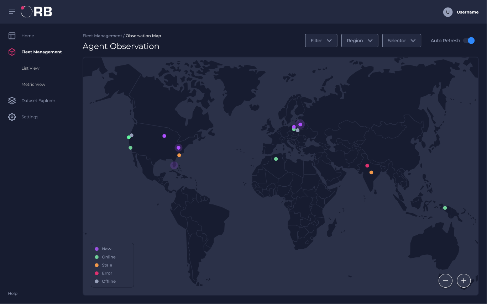

**Orb** is a new kind of observability platform that helps operators, developers, and end users understand their
networks, distributed applications, and traffic flows in real time.

Ready to dive in? See [getorb.io](https://getorb.io) for [installation instructions](https://getorb.io/install/).

# Why Orb?

## Distributed Deep Network Observability

Orb manages a [fleet](https://getorb.io/about/#fleet) of [agents](https://getorb.io/about/#agent) deployed across
distributed, hybrid infrastructure:
containers, VMs, servers, routers and switches. The agent taps into traffic streams and extracts real time insights,
resulting in light-weight, actionable metrics.

## Streaming Analysis at the Edge

Based on the [pktvisor observability agent](https://pktvisor.dev), Orb's goal is to push analysis to the edge, where
high resolution data can be analysed in real time without the need to send raw data to a central location for batch
processing.
[Current analysis](https://github.com/ns1labs/pktvisor/wiki/Current-Metrics) focuses on L2-L3 Network, DNS, and DHCP
with more analyzers in the works.

## Realtime Agent Orchestration

Orb uses IoT principals to allow the observability agents to connect out to the Orb central control plane, avoiding
firewall problems. Once connected, agents are controlled in real time from the Orb Portal or REST API, orchestrating
observability [policies](https://getorb.io/about/#policies) designed to precisely extract the desired insights. Agents
are grouped and addressed based on [tags](https://getorb.io/about/#agent-group).

## Flexible Integration With Modern Observability Stacks

Orb was built to integrate with modern observability stacks, supporting [Prometheus](https://prometheus.io/) natively
and designed to support arbitrary [sinks](https://getorb.io/about/#sinks) in the future. Collection and sinking of the
metrics from the agents is included; there is no need to run additional data collection pipelines for Orb metrics.

## Portal and REST API Included

Orb includes a modern, responsive UI for managing Agents, Agent Groups, Policies and Sinks. Orb is API first, and all
platform functionality is available for automation via
the [well documented REST API](https://getorb.io/docs/#working-with-api-docs).

## Open Source, Vendor Neutral, Cloud Native

Orb is free, open source software (FOSS) released under MPL. It's a modern microservices application that can be
deployed to any Kubernetes service in private or public cloud. It does not depend on any one vendor to function, thus
avoiding vendor lock-in.

***

# Backed by NS1

**Orb** was born at [NS1 Labs](https://ns1.com/labs), where we're committed to
making [open source, dynamic edge observability a reality](https://ns1.com/blog/orb-a-new-paradigm-for-dynamic-edge-observability)
.

***

* [Installation Instructions](https://getorb.io/install/)
* [View our Wiki](https://github.com/ns1labs/orb/wiki) for technical and architectural information
* [File an issue](https://github.com/ns1labs/orb/issues/new)
* Follow our [public work board](https://github.com/ns1labs/orb/projects/2)
* Start a [Discussion](https://github.com/ns1labs/orb/discussions)
* [Join us on Slack](https://join.slack.com/t/ns1labs/shared_invite/zt-qqsm5cb4-9fsq1xa~R3h~nX6W0sJzmA)
* Send mail to [info@pktvisor.dev](mailto:info@pktvisor.dev)
