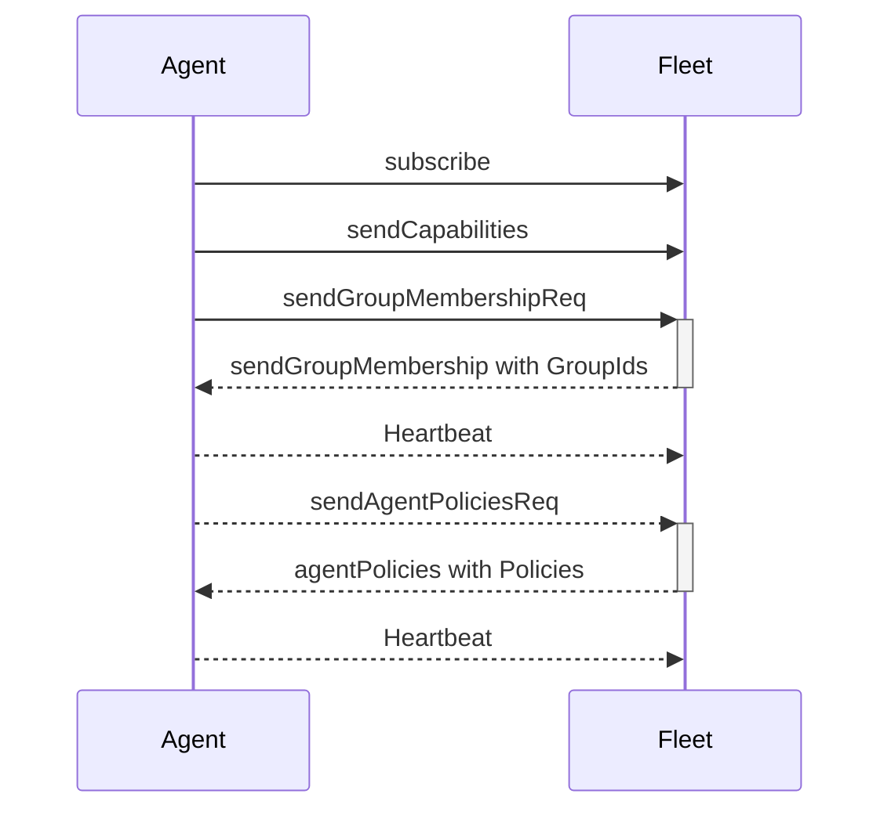
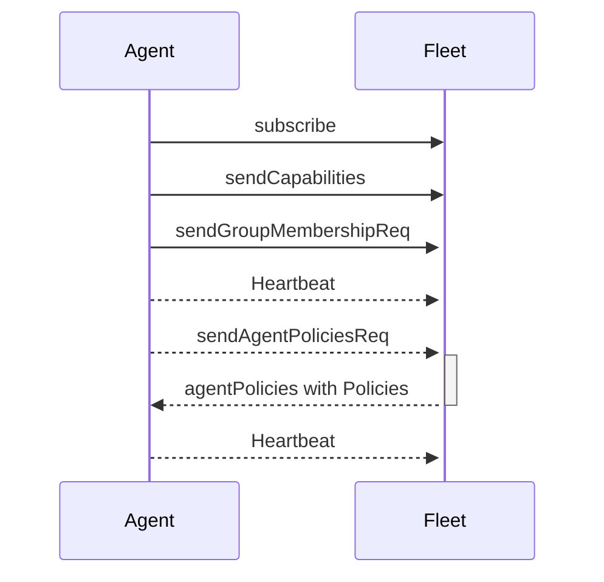
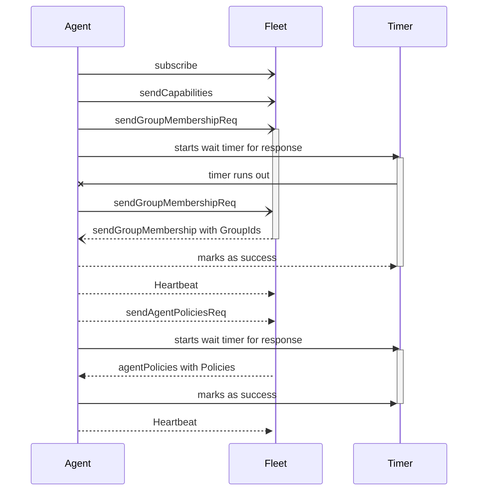

# Orb Agent

Agent - Fleet Synchronization Steps

Success Communication Sequence Diagram

Fail Communication Sequence Diagram

Agent is still without Groups and Policies

With Re-Request Mechanism, general idea

