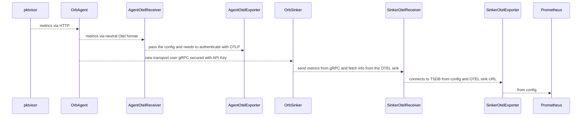

#Integration tests for Open Telemetry Pktvisor Agent Receiver

- [ ] POC with TODO API, 
  - [ ] create a sinker service to fetch configs sink from config file/or hardcoded to send to TSDBs
  - [ ] Adapt TODO API to send to sinker service with auth via GRPC
  - [ ] Adapt sinker service to authenticate to Prometheus
  - [ ] Present POC
- [ ] Implement similar auth module within otlpexporter in agent 
- [ ] Make agent connect to the POC sinker service
- [ ] Bring new sinker OTEL service to Orb 
- [ ] Present POC

