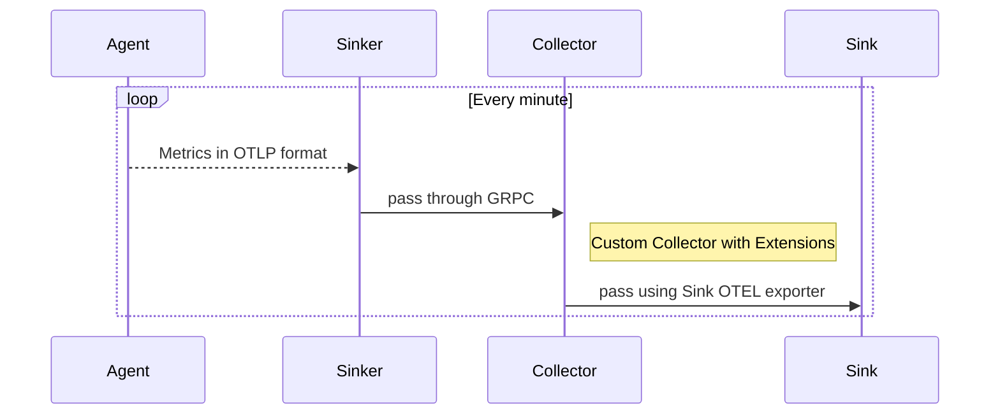
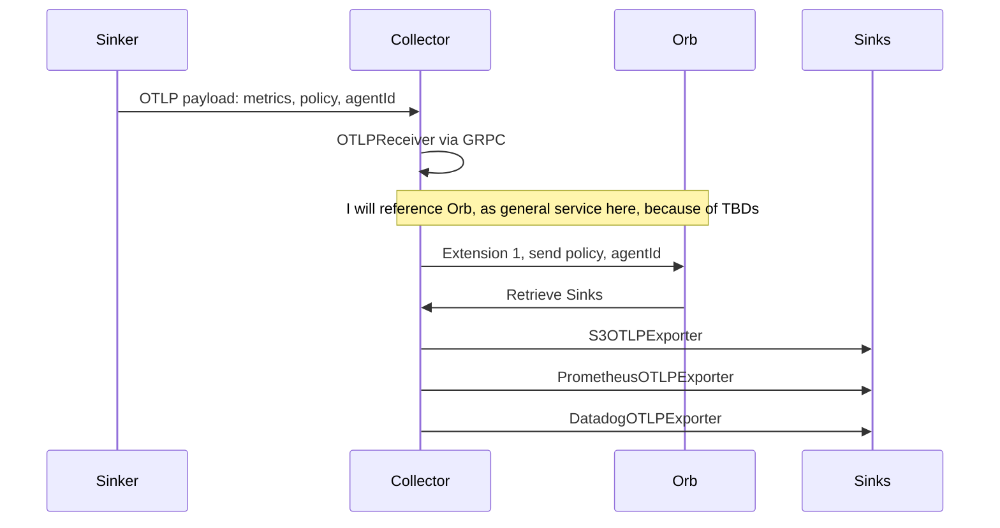
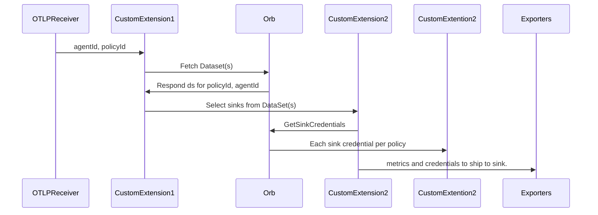
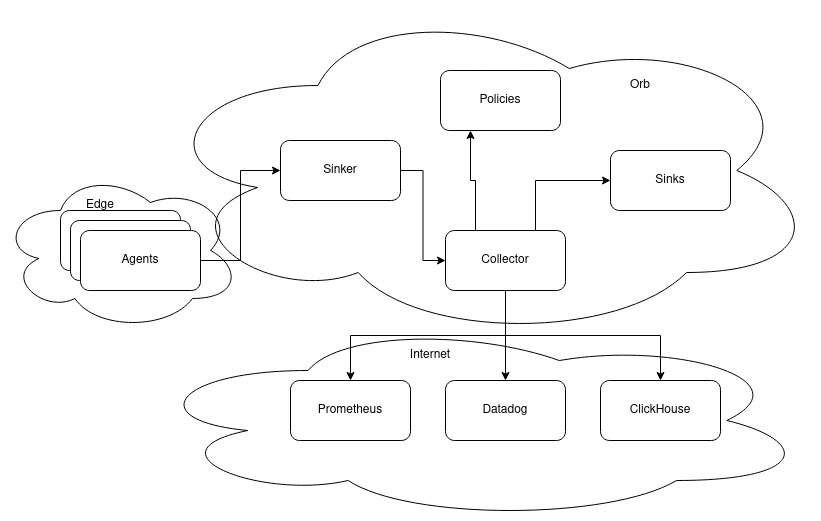

# How Orb Agent would send info in otlp to the Orb Sink

Orb Agent fetches information from Pktvisor using a receiver pktvisorreceiver in package that implements a customized receiver from opentelemetry.

In the PR [1428](https://github.com/etaques/orb/pull/1428), the orb-agent has now the opentelemetry exporter that will, pass the otlp through MQTT, through the usual channels that orb-sinker receives the information.

In a sequence Diagram as follows

Let's expand a bit the visio on what will happen in between Collector and Sink.

The Collector would be a custom implementation of the [Open Telemetry Collector](https://github.com/open-telemetry/opentelemetry-collector-contrib)

Here is a diagram of that

Here is another diagram of that.

## Concurrency and Scaling

TDB

Think of strategies of scaling

Sharding could be one

## Pktvisor scraping metrics and how OTLP format can change that

