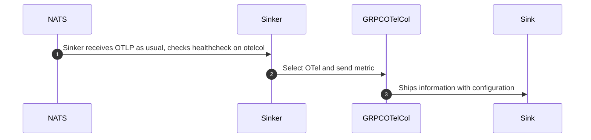
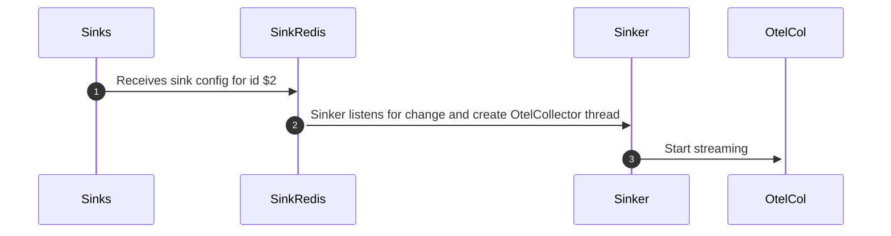
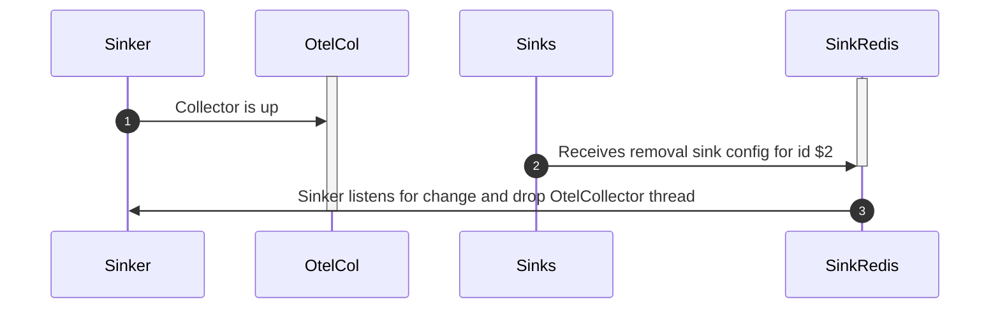
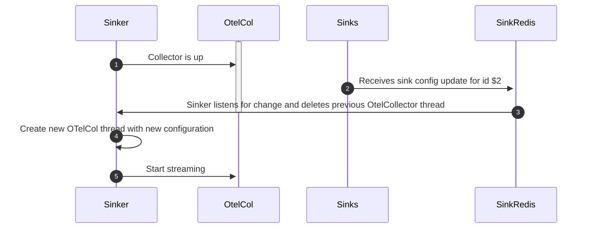

## Diagrams

### Metrics Flow

```mermaid
sequenceDiagram
    autonumber 1
    NATS->>Sinker: Sinker receives OTLP as usual, checks healthcheck on otelcol
    Sinker->>GRPCOTelCol: Select OTel and send metric
    GRPCOTelCol->>Sink: Ships information with configuration
```

### Sink and OTelCol Creation

```mermaid
sequenceDiagram
    autonumber 1
    Sinks->>SinkRedis: Receives sink config for id $2
    activate SinkRedis
    SinkRedis->>Sinker: Sinker listens for change and create OtelCollector thread
    activate OtelCol
    Sinker->>OtelCol: Start streaming
```

### Sink and Otel Removal

```mermaid
sequenceDiagram
    autonumber 1
    activate OtelCol
    activate SinkRedis
    Sinker->>OtelCol: Collector is up
    Sinks->>SinkRedis: Receives removal sink config for id $2
    deactivate SinkRedis
    SinkRedis->>Sinker: Sinker listens for change and drop OtelCollector thread
    deactivate OtelCol
```

### Sink and Otel Update

```mermaid
sequenceDiagram
    autonumber 1
    activate SinkRedis
    activate OtelCol
    Sinker->>OtelCol: Collector is up
    Sinks->>SinkRedis: Receives sink config update for id $2
    SinkRedis->>Sinker: Sinker listens for change and deletes previous OtelCollector thread
    deactivate OtelCol
    activate OtelCol
    Sinker->>Sinker: Create new OTelCol thread with new configuration
    Sinker->>OtelCol: Start streaming
```
