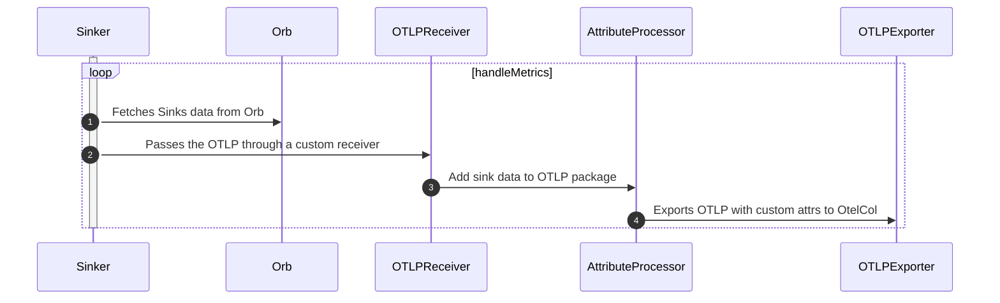
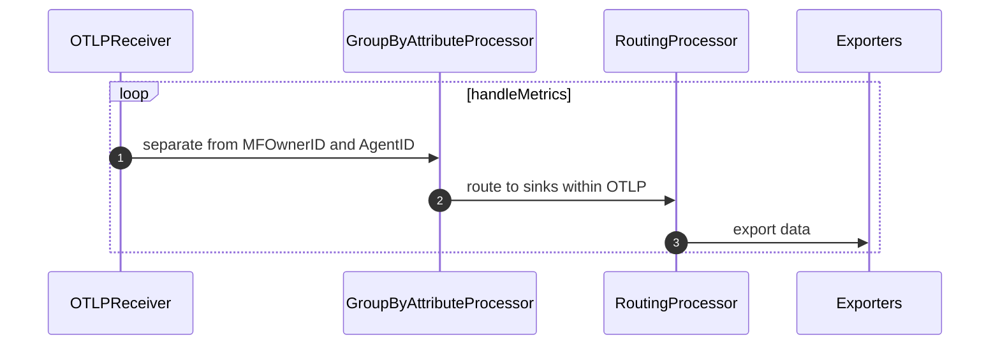

# OtelCol Components and How Orb uses them


## Sinker OTLP
In the Sinker, where we receive metrics from the orb-agents in the handleMetrics function



## OtelCol

Here is how the orb otel-collector should work 



To test and check performance, these processors could be activated after Routing

```go
import (
	"go.opentelemetry.io/collector/processor/batchprocessor"
        "go.opentelemetry.io/collector/processor/memorylimiterprocessor"
)
_ = []component.Factories{
    // current version and stability for metrics [ 0.56.0 , beta ]
    batchprocessor.NewFactory(),
    // current version and stability for metrics [ 0.56.0 , beta ]
    memorylimiterprocessor.NewFactory(),
}
```
