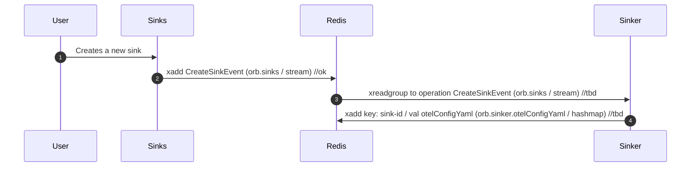
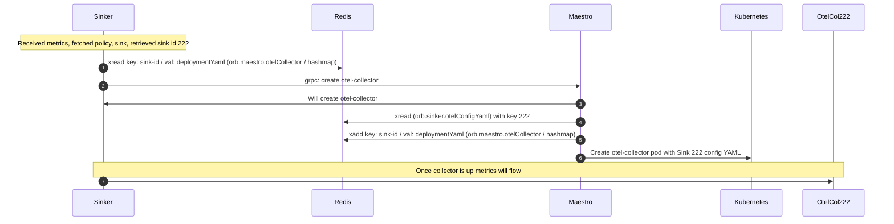

## Create

```mermaid
sequenceDiagram
    autoNumber 1
    User->>Sinks: Creates a new sink
    Sinks->>Redis: xadd CreateSinkEvent (orb.sinks / stream) //ok
    Redis->>Sinker: xreadgroup to operation CreateSinkEvent (orb.sinks / stream) //tbd
    Sinker->>Redis: xadd key: sink-id / val otelConfigYaml (orb.sinker.otelConfigYaml / hashmap) //tbd
    
```

```mermaid
sequenceDiagram
    autoNumber 1
    Note over Sinker: Received metrics, fetched policy, sink, retrieved sink id 222
    Sinker->>Redis: xread key: sink-id / val: deploymentYaml (orb.maestro.otelCollector / hashmap)
    Sinker->>Maestro: grpc: create otel-collector
    Maestro->>Sinker: Will create otel-collector
    Maestro->>Redis: xread (orb.sinker.otelConfigYaml) with key 222
    Maestro->>Redis: xadd key: sink-id / val: deploymentYaml (orb.maestro.otelCollector / hashmap)
    Maestro->>Kubernetes: Create otel-collector pod with Sink 222 config YAML
    Note over Sinker,OtelCol222: Once collector is up metrics will flow
    Sinker->>OtelCol222: 
```
