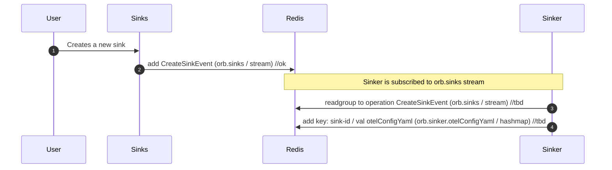
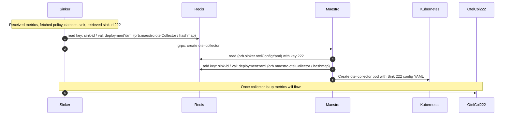
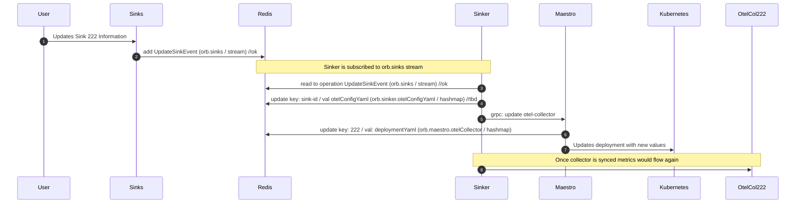
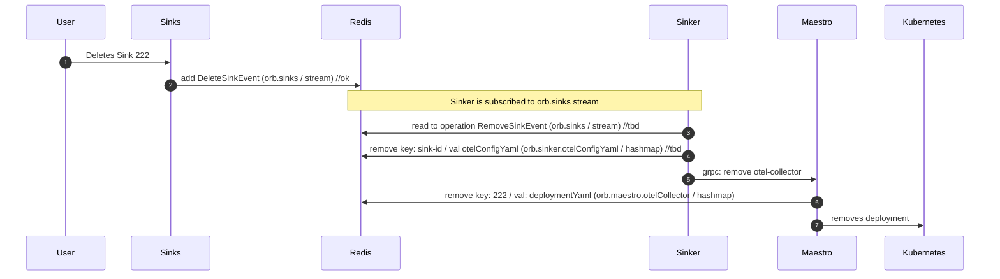

# Sink-Collector Sequence Diagrams

## On Create Sink

The new service, which will trigger K8s New pods, is called Maestro for now

## Create

```mermaid
sequenceDiagram
    autoNumber 1
    User->>Sinks: Creates a new sink
    Sinks->>Redis: add CreateSinkEvent (orb.sinks / stream) //ok
    Note over Sinker,Redis: Sinker is subscribed to orb.sinks stream
    Sinker->>Redis: readgroup to operation CreateSinkEvent (orb.sinks / stream) //tbd
    Sinker->>Redis: add key: sink-id / val otelConfigYaml (orb.sinker.otelConfigYaml / hashmap) //tbd
    
```

```mermaid
sequenceDiagram
    autoNumber 1
    Note over Sinker: Received metrics, fetched policy, dataset, sink, retrieved sink id 222
    Sinker->>Redis: read key: sink-id / val: deploymentYaml (orb.maestro.otelCollector / hashmap)
    Sinker->>Maestro: grpc: create otel-collector
    Maestro->>Redis: read (orb.sinker.otelConfigYaml) with key 222
    Maestro->>Redis: add key: sink-id / val: deploymentYaml (orb.maestro.otelCollector / hashmap)
    Maestro->>Kubernetes: Create otel-collector pod with Sink 222 config YAML
    Note over Sinker,OtelCol222: Once collector is up metrics will flow
    Sinker->>OtelCol222: 
```

## Update

```mermaid
sequenceDiagram
    autoNumber 1
    User->>Sinks: Updates Sink 222 Information
    Sinks->>Redis: add UpdateSinkEvent (orb.sinks / stream) //ok
    Note over Sinker,Redis: Sinker is subscribed to orb.sinks stream
    Sinker->>Redis: read to operation UpdateSinkEvent (orb.sinks / stream) //ok
    Sinker->>Redis: update key: sink-id / val otelConfigYaml (orb.sinker.otelConfigYaml / hashmap) //tbd
    Sinker->>Maestro: grpc: update otel-collector
    Maestro->>Redis: update key: 222 / val: deploymentYaml (orb.maestro.otelCollector / hashmap)
    Maestro->>Kubernetes: Updates deployment with new values
    Note over Sinker,OtelCol222: Once collector is synced metrics would flow again
    Sinker->>OtelCol222: 
```

## Delete

```mermaid
sequenceDiagram
    autoNumber 1
    User->>Sinks: Deletes Sink 222
    Sinks->>Redis: add DeleteSinkEvent (orb.sinks / stream) //ok
    Note over Sinker,Redis: Sinker is subscribed to orb.sinks stream
    Sinker->>Redis: read to operation RemoveSinkEvent (orb.sinks / stream) //tbd
    Sinker->>Redis: remove key: sink-id / val otelConfigYaml (orb.sinker.otelConfigYaml / hashmap) //tbd
    Sinker->>Maestro: grpc: remove otel-collector
    Maestro->>Redis: remove key: 222 / val: deploymentYaml (orb.maestro.otelCollector / hashmap)
    Maestro->>Kubernetes: removes deployment
```
